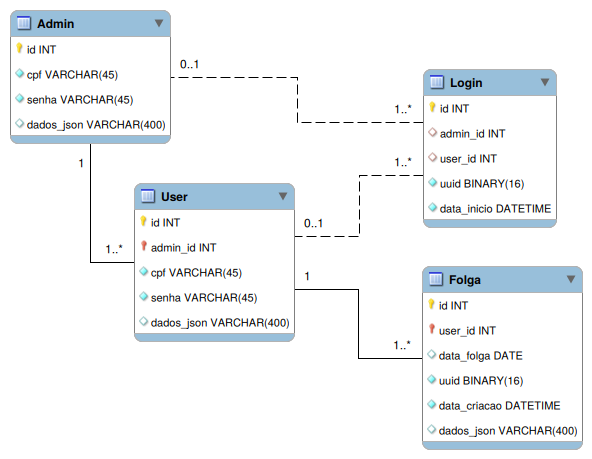

# Database

Parte database do projeto, desenvolvida com _MySQL_ e _MySQL Workbench_.

- `pm-manager.mwb`: O schema do banco de dados, permite o recriar utilizando a funcionalidade _Forward Engineer_ de _MySQL Workbench_.

- `manualTests.sql`: Script SQL que permite testar todas as funcionalidades do banco de dados. Cada linha deve ser executada manualmente.

- `buildDatabase.sql`: Script gerado por _MySQL Workbench_. Este destrói e recria o banco de dados.

## Controle

O acesso e manipulação das tabelas não é feita diretamente pelo backend. Aqui, procedures executam todas as ações.

Isso garante que o banco de dados permaneça íntegro.

## Entidades

`Admin`, `User`, e `Folga` são as entidades principais.

`Login` armazena sessões de `Admin` ou `User` e permite controlar seus acessos a funcionalidades.

Cada `Folga` é relacionada a um `User`, que é gerenciado por um `Admin`.

<i>Diagrama EER</i>

## Desenvolvimento

É necessário ter _MySQL_ e _MySQL Workbench_ instalados.
