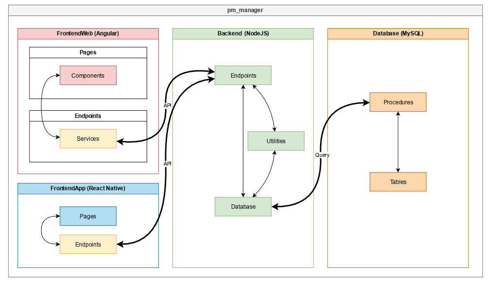
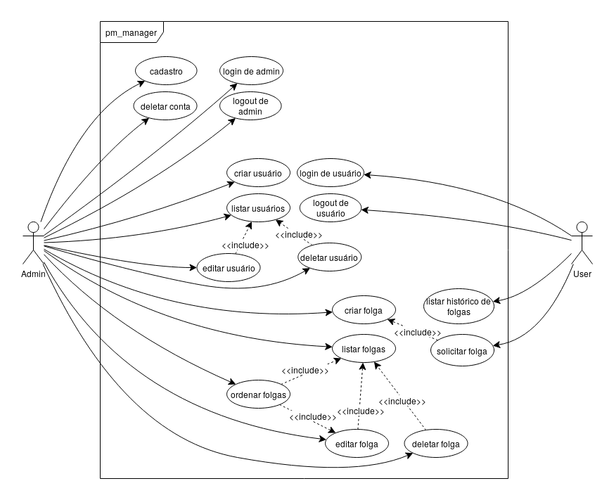

# PM Manager

Sistema para o gerenciamento de folgas de Policiais Militares.

## Arquitetura

[`FrontendApp`](./FrontendApp#readme) consiste no app mobile, para o uso dos PMs.

[`FrontendWeb`](./FrontendWeb#readme) consiste no site, para o uso do administrador.

[`Backend`](./Backend#readme) consiste no servidor, que conecta todas as partes.

[`Database`](./Database#readme) consiste no banco de dados, usado para guardar os dados do sistema.

<i>Diagrama do sistema</i>

## Funcionalidades

O sistema possui 2 tipos de usuários: Admin e User.

O Admin tem total controle das funcionalidades, e o User pode apenas consultar e solicitar folgas.

<i>Diagrama de Caso de Uso</i>

